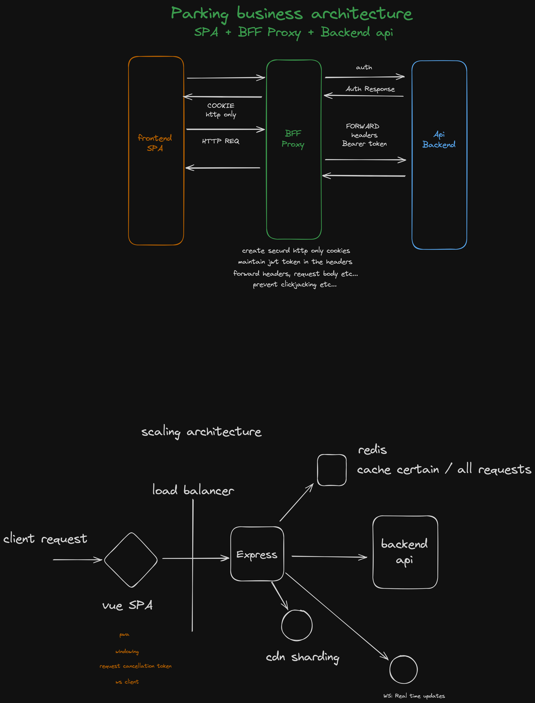
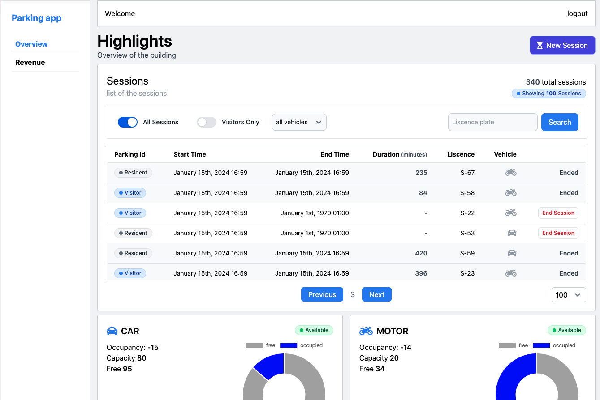
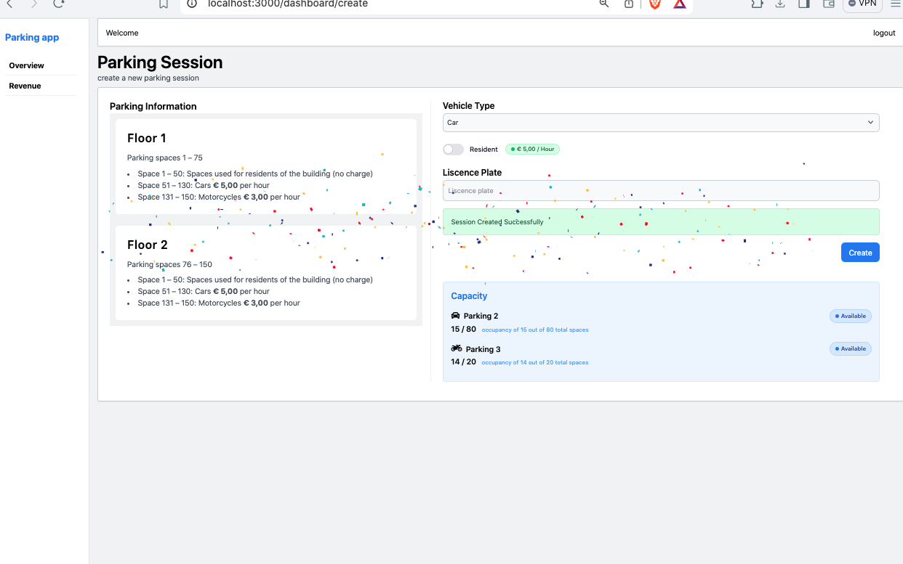

# Frontend coding challenge - ParkingBusiness

for setup, check the setup below

## SPA BFF BE Architecture


Scaling architecture



illustrating potential solution to scale the full stack architecture
to support large real time data sets

## Tech stack

- typescript + zod <3
- vue 3 + pinia + vue router
- tailwind css
- express with http-request-middleware
- axios
- vitest for testing (unit, snapshots and inline snapshotting)

## Features

- login /logout
- dashboard overview
- revenue overview
- start session form

## Extra added features

- multiple layouts
- request cancellations
- offline indicator
- some responsiveness for small screen size support
- loading indicators skeleton loaders
- some charts
- some confetti for fun

Request cancellation is an extra ability to cancel outgoing requests
while some are requests are still pending.

## Preview

<div style="position: relative; padding-bottom: 56.25%; height: 0;"><iframe src="https://www.loom.com/embed/e32271c3eccc43bb98fffea73a906287?sid=8a1a82b8-7dd8-4ad9-9a0c-f0613c982dac" frameborder="0" webkitallowfullscreen mozallowfullscreen allowfullscreen style="position: absolute; top: 0; left: 0; width: 100%; height: 100%;"></iframe></div>

https://www.loom.com/share/e32271c3eccc43bb98fffea73a906287?sid=994b6628-1f24-4ae1-bd83-bdd603157bb8





# SETUP

This template should help get you started developing with Vue 3 in Vite.

## Prerequisits

```sh
node version >= 18
```

## Recommended IDE Setup

[VSCode](https://code.visualstudio.com/) + [Volar](https://marketplace.visualstudio.com/items?itemName=Vue.volar) (and disable Vetur).

## Type Support for `.vue` Imports in TS

TypeScript cannot handle type information for `.vue` imports by default, so we replace the `tsc` CLI with `vue-tsc` for type checking. In editors, we need [Volar](https://marketplace.visualstudio.com/items?itemName=Vue.volar) to make the TypeScript language service aware of `.vue` types.

## Customize configuration

See [Vite Configuration Reference](https://vitejs.dev/config/).

## Project Setup

```sh
npm install
```

### Compile and Hot-Reload for Development

```sh
npm run dev
```

### Type-Check, Compile and Minify for Production

```sh
npm run build
```

### Run Unit Tests with [Vitest](https://vitest.dev/)

```sh
npm run test:unit
```

### Lint with [ESLint](https://eslint.org/)

```sh
npm run lint
```

### Run production ready mode and preview on localhost:3000

```sh
npm run prod
```

if you testing on safari, check `server/index.js` for details about how to
get around safari not storing localhost cookies
this will run a quick production mode preview on `localhost:3000`
