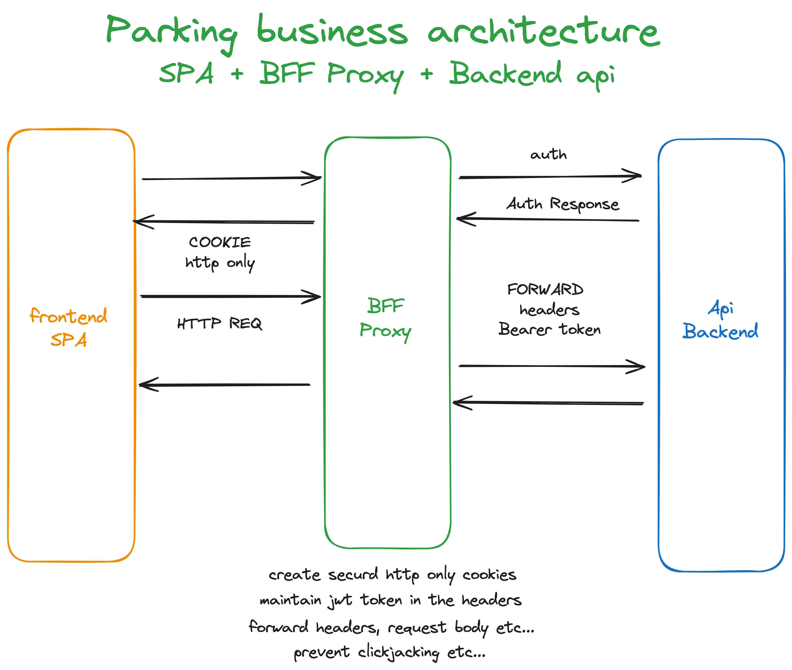
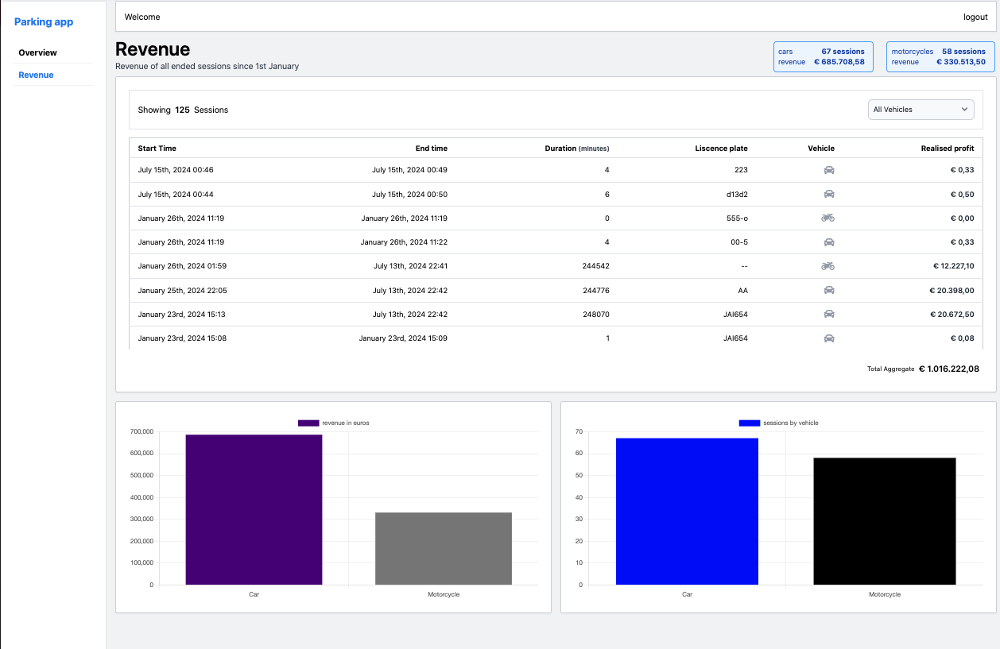

# bf-assignment-hichem-ben-chaabene

for setup, check the setup below

## SPA BFF BE Architecture



## Preview





# SETUP

This template should help get you started developing with Vue 3 in Vite.

## Prerequisits

```sh
node version > 18
```

## Recommended IDE Setup

[VSCode](https://code.visualstudio.com/) + [Volar](https://marketplace.visualstudio.com/items?itemName=Vue.volar) (and disable Vetur).

## Type Support for `.vue` Imports in TS

TypeScript cannot handle type information for `.vue` imports by default, so we replace the `tsc` CLI with `vue-tsc` for type checking. In editors, we need [Volar](https://marketplace.visualstudio.com/items?itemName=Vue.volar) to make the TypeScript language service aware of `.vue` types.

## Customize configuration

See [Vite Configuration Reference](https://vitejs.dev/config/).

## Project Setup

```sh
npm install
```

### Compile and Hot-Reload for Development

```sh
npm run dev
```

### Type-Check, Compile and Minify for Production

```sh
npm run build
```

### Run Unit Tests with [Vitest](https://vitest.dev/)

```sh
npm run test:unit
```

### Lint with [ESLint](https://eslint.org/)

```sh
npm run lint
```

### Run production ready mode and preview on localhost:3000

```sh
npm run prod
```

if you testing on safari, check `server/index.js` for details about how to
get around safari not storing localhost cookies
this will run a quick production mode preview on `localhost:3000`
